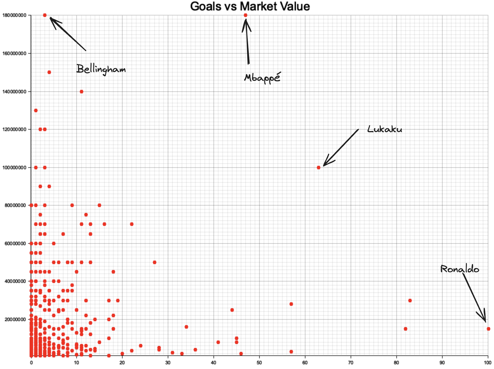

# Using Rust to do some basic data-science / descriptive statistics 
- on the [Kaggle dataset: UEFA EURO 2024 - Players](https://www.kaggle.com/datasets/damirdizdarevic/uefa-euro-2024-players)
  
## plotting market-value agaist scored national team goals


## Usage
```bash
# clone repo
git clone https://github.com/matsjfunke/descriptive-statistics-rust.git
# run main.rs
cargo run
# view top 10 most valueable players in the euro 2024
# view top 10 best national goal scorers of prior to euro 2024
# view plot
open images/scatter_plot.png
```

## Project Structure
```
├── Cargo.lock
├── Cargo.toml -> dependencies
├── README.md
├── euro2024_players.csv -> dataset
├── images
│   ├── labeled_scatter.png
│   └── scatter_plot.png
└── src
    ├── main.rs -> entrypoint & dataset processing (csv to rust vector)
    ├── models.rs -> defines data structures
    └── top_ten.rs -> function for printing top 10 players
```
