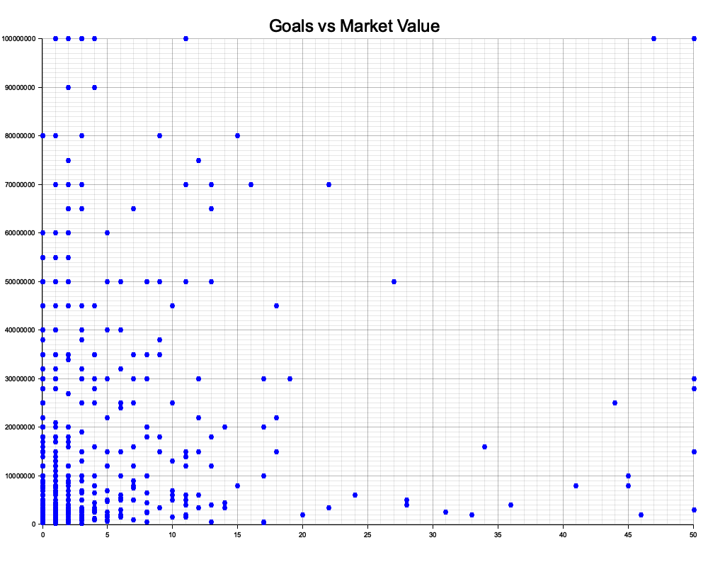

# Using Rust to do some basic data-science / descriptive statistics 
- on the [Kaggle dataset: UEFA EURO 2024 - Players](https://www.kaggle.com/datasets/damirdizdarevic/uefa-euro-2024-players)
  
## plotting market-value agaist scored national team goals

