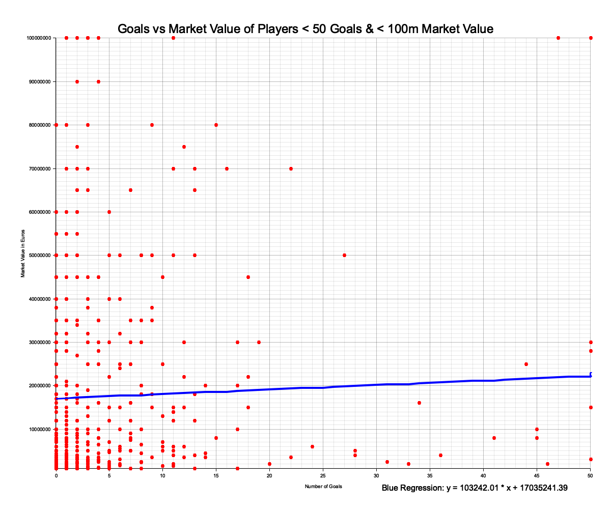

# Rust for Basic Data Science / Descriptive Statistics

This project leverages Rust to calculate basic descriptive statistics and apply linear regression on the [Kaggle dataset: UEFA EURO 2024 - Players](https://www.kaggle.com/datasets/damirdizdarevic/uefa-euro-2024-players).

## Features

### Descriptive Statistics
- Mean
- Median 
- Mode
- Range
- Variance
- Standard Deviation

### Linear Regression
- Predict market value given national team goals
- Predict national team goals given market value

### Data Visualization
- Plot market value against national team goals


## Project Structure
```
├── Cargo.lock
├── Cargo.toml       # Dependencies
├── README.md
├── euro2024_players.csv  # Dataset
├── images
│   ├── labeled_scatter.png
│   ├── lin_reg_scatter.png
│   └── scatter_plot.png
└── src
    ├── linear_regression.rs  # Calculates linear regression to predict market value given national team goals & vice versa
    ├── main.rs               # Entrypoint & dataset processing (csv to Rust vector)
    ├── models.rs             # Defines data structures
    ├── statistics.rs         # Functions to compute statistical measures
    ├── plot.rs               # Plots relationship of goals (x-axis) and market value (y-axis) & linear function
    └── top_ten.rs            # Functions for printing top 10 players
```

## Usage

1. Clone the repository:
    ```bash
    git clone https://github.com/matsjfunke/descriptive-statistics-rust.git
    ```
2. Run the main program:
    ```bash
    cd descriptive-statistics-rust
    cargo run
    ```

3. View the results:
    - Descriptive statistics
    - Top 10 most valuable players in EURO 2024
    - Top 10 best national goal scorers prior to EURO 2024
    - Linear regression prediction
    - Generated plots: open `images/scatter_plot.png`



## Example Output
```bash
Mean Market Value: 19400816.6969147
Median Market Value: 9000000
Mode Market Value: 5000000
Range Market Value: 179800000
Variance Market Value: 637586982091626.9
Standard Deviation Market Value: 25250484.789239727
Mean Goals: 4.695099818511797
Median Goals: 2
Mode Goals: 0
Range Goals: 128
Variance Goals: 112.30630992651554
Standard Deviation Goals: 10.597467146753301

Top 10 most valuable players:
1. Jude Bellingham - Market Value: 180000000
2. Kylian Mbappé - Market Value: 180000000
3. Phil Foden - Market Value: 150000000
4. Bukayo Saka - Market Value: 140000000
5. Florian Wirtz - Market Value: 130000000
6. Jamal Musiala - Market Value: 120000000
7. Rodri - Market Value: 120000000
8. Declan Rice - Market Value: 120000000
9. Harry Kane - Market Value: 100000000
10. Aurélien Tchouaméni - Market Value: 100000000

Top 10 players with most goals:
1. Cristiano Ronaldo - Goals: 128
2. Romelu Lukaku - Goals: 83
3. Robert Lewandowski - Goals: 82
4. Harry Kane - Goals: 63
5. Aleksandar Mitrovic - Goals: 57
6. Olivier Giroud - Goals: 57
7. Kylian Mbappé - Goals: 47
8. Andriy Yarmolenko - Goals: 46
9. Thomas Müller - Goals: 45
10. Memphis Depay - Goals: 45

Final parameters: m = 103242.00641861373, b = 17035241.38989226
Prediction: a player with 5.5 goals has an expected market value of 17603072.43 €
Prediction: a player with  market value of 17603072.43 € is expected to have 5.5 nationalteam goals
```

